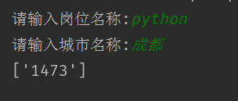

# 爬虫学习使用指南---简单应用案例

>Auth: 王海飞
>
>Data：2018-06-06
>
>Email：779598160@qq.com
>
>github：https://github.com/coco369/knowledge 

### 1. 分析百度的搜索

当我们通过百度搜索引擎去搜索python语言的时候，可以发现百度搜索的url中有很多无用的参数，过滤掉无用的参数，最后的请求url可以展示为，如下的信息：

	https://www.baidu.com/s?wd=python%E8%AF%AD%E8%A8%80

其中搜索的是python语言，中文被编码为3个字符表示

#### 1.1 使用urllib进行中文的编码和解码
	
	from urllib import parse

	# 编码
	enstr = parse.urlencode({'kd': '千峰'})
	# 打印的结果为 kd=%E5%8D%83%E5%B3%B0
	print(enstr)

	# 解码
	destr = parse.unquote(enstr)
	# 解码的结果为 kd=千峰
	print(destr)

#### 1.2 简单案例--百度搜索(search_spider03.py)

自定义百度的搜索url，获取页面源码。以下案例中，我搜索王海飞，查看一下搜索e的结果页面如何。

	import urllib.request
	from urllib import parse
	
	def baidu_api(search):
	    url = 'https://www.baidu.com/s?' + search
	    header = {
	        'User-Agent': 'Mozilla/5.0 (Windows NT 6.1; WOW64) AppleWebKit/537.36 (KHTML, like Gecko) Chrome/65.0.3325.181 Safari/537.36'
	    }
	    res = urllib.request.Request(url=url, headers=header)
	    r = urllib.request.urlopen(res)
	    print(r.read().decode('utf-8'))
	
	
	if __name__ == '__main__':
	
	    search = input('请输入搜索的数据:')
	    wd = parse.urlencode({'wd': search})
	    baidu_api(wd)

#### 1.3 智联岗位爬取(zhilian_spider04.py)

	import urllib.request
	import re
	from urllib import parse
	
	
	def zhaopin_msg(url):
	    """
	     获取智联上招聘信息
	     1. 获取职位的个数
	        
	            共<em>1473</em>个职位满足条件
	        
	    """
	    header = {
	        'User-Agent': 'Mozilla/5.0 (Windows NT 6.1; WOW64) AppleWebKit/537.36 (KHTML, like Gecko) Chrome/65.0.3325.181 Safari/537.36'
	    }
	    req = urllib.request.Request(url=url, headers=header)
	    res = urllib.request.urlopen(req)
	
	    # 正则匹配，查询的结果为职位的个数
	    count_job = re.findall('<em>(\d+)</em>', res.read().decode('utf-8'))
	
	    return count_job
	
	
	if __name__ == '__main__':
	
	    # 获取从客户端接收到的参数
	    job_name = input('请输入岗位名称:')
	    city_name = input('请输入城市名称:')
	
	    # 将输入参数进行编码，输入参数，python和成都，输出结果为:jl=%E6%88%90%E9%83%BD&kw=python
	    search_params = parse.urlencode({'jl': city_name, 'kw': job_name})
	    # urllib进行解析的网站的url
	    url = 'https://sou.zhaopin.com/jobs/searchresult.ashx?%s' % search_params
	    # 进行解析地址
	    result = zhaopin_msg(url)
	    print(result)

调试：搜索成都的python岗位的职位个数

#### 1.4 智联岗位爬取，岗位名称，岗位的公司信息(zhilian_spider04.py)

该案例比只爬取岗位个数更进一步，需要使用xpath来解析整个页面，获取想要的数据。

	from lxml import etree

	# 查询岗位名称和公司名称
    tree = etree.HTML(res.read())
    content1 = tree.xpath('//tr/td/div/a[1]/text()')
    content2 = tree.xpath('//tr/td/a[1]/text()')
    return content1, content2

#### 1.5 爬取豆瓣电影的电影名、评分等信息(douban_movie05.py)
	
	
	import urllib.request
	from urllib import parse
	import json
	
	"""
	获取豆瓣电影中的电影资源
	豆瓣电影url地址：https://movie.douban.com/explore#!type=movie&tag=%E7%83%AD%E9%97%A8&sort=recommend&page_limit=20&page_start=0
	分析：
	    1. 该页面中的的电影资源信息都是通过ajax异步加载进行刷新出来的
	    2. 在F12下的network中过滤XHR(XMLHTTPRESPONSE)请求，可以查看到真正的异步的请求地址如下
	        https://movie.douban.com/j/search_subjects?type=movie&tag=%E7%83%AD%E9%97%A8&sort=recommend&page_limit=20&page_start=20
	    3. 正在的请求地址中，type为类型，tag为标签（热门、经典、最新、爱情、科幻等等），sort为排序，page_limit为每一个的条数，page_start为开始的条数下标
	    4. 获取tag类型的url地址为： https://movie.douban.com/j/search_tags?type=movie&source=
	"""
	
	
	def urllib_open(url):
	    """
	    公共的处理代码
	    """
	    header = {
	        'User-Agent': 'Mozilla/5.0 (Windows NT 6.1; WOW64) AppleWebKit/537.36 (KHTML, like Gecko) Chrome/65.0.3325.181 Safari/537.36'
	    }
	    req = urllib.request.Request(url=url, headers=header)
	    res = urllib.request.urlopen(req)
	
	    return res.read().decode('utf-8')
	
	
	def get_movie_tag(url):
	    """
	    获取电影的分类tag
	    """
	    tag_res = urllib_open(url)
	    # 返回的tag_res的结果为'{"tags":["热门","最新","经典","可播放","豆瓣高分","冷门佳片","华语","欧美","韩国","日本","动作","喜剧","爱情","科幻","悬疑","恐怖","成长"]}'
	    # 其结果为一个字符串类型的数据，需要将之转化为字典类型的
	    result = json.loads(tag_res)
	    content = result['tags']
	    return content
	
	
	def get_movies(tag_url, movies_url):
	    tag_content = get_movie_tag(tag_url)
	    # 循环tag的内容，拼接出指定tag的电影内容
	    # movies_url中指定电影类型的参数是tag=热门或者最新等等，所以需要进行tag的内容的编码
	    tag_list = []
	    print(tag_content)
	    for tag in tag_content:
	        data = {'tag': tag}
	        search_tag = parse.urlencode(data)
	        tag_list.append(search_tag)
	
	    for search_tag in tag_list:
	        seatch_url = movies_url
	        seatch_url = seatch_url % (search_tag)
	        movies_res = urllib_open(seatch_url)
	        res = json.loads(movies_res)
	        result = res['subjects']
	        for res in result:
	            print('标题:%s，评分：%s' % (res['title'], res['rate']))
	
	if __name__ == '__main__':
	    tag_url = 'https://movie.douban.com/j/search_tags?type=movie&source='
	    movies_url = 'https://movie.douban.com/j/search_subjects?type=movie&%s&sort=recommend&page_limit=20&page_start=0'
	    get_movies(tag_url, movies_url)
	

其中：如果需要传递post请求的时候，需要传递post请求的参数，urllib.request.Request(rul, data, headers)

查看urllib.request下的Request.py文件可以看到以下源码，如果有data参数，则表示该请求url为POST请求：

